# Implementación de objetos de programabilidad con SQL

## Requisitos previos

Primero descargamos la bbdd que necestiamos para el lab.

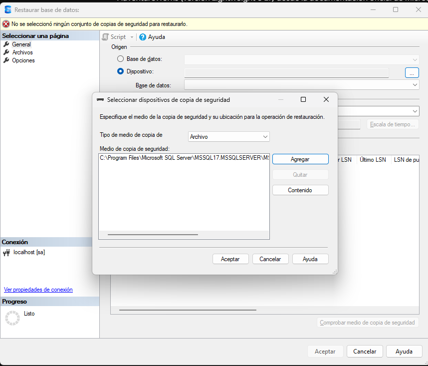

## Conexión con AdventureWorksLT

la restaure y la puse en esta direccion q nos indica la web oficial de microsoft 
´C:\Program Files\Microsoft SQL Server\MSSQL17.MSSQLSERVER\MSSQL\Backup´

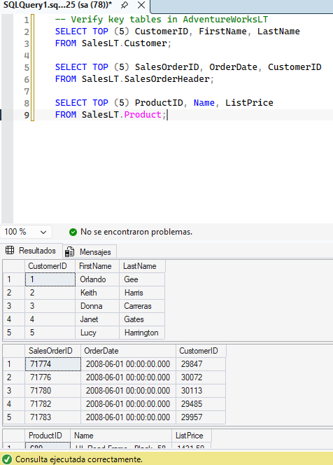

## Creación de una vista para simplificar las consultas

Creé una vista que combina los clientes con sus pedidos en el esquema `SalesLT`. De esta forma, dejé preparada una consulta reutilizable y oculté la complejidad de las relaciones entre tablas.

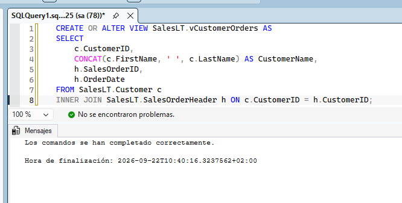

A continuación, validé que la vista se hubiera creado correctamente y que devolviera los datos esperados.

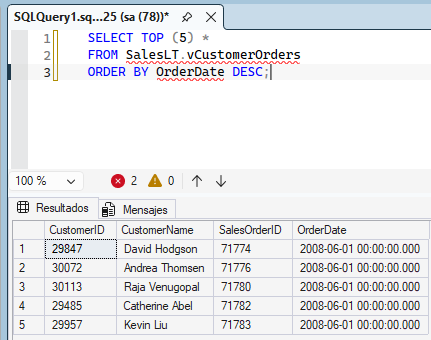

## Creación de un procedimiento almacenado para procesar un pedido

Encapsulé en un procedimiento almacenado la operación de añadir una línea a un pedido existente en AdventureWorksLT. El procedimiento también actualiza el subtotal de la cabecera del pedido.

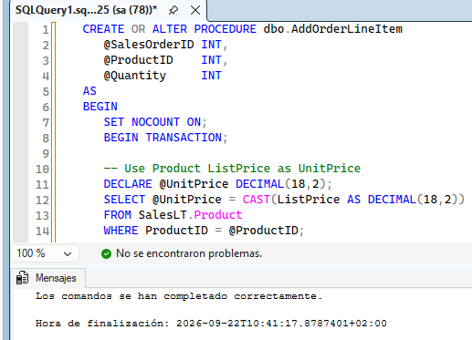

Después ejecuté el código T-SQL de prueba para comprobar que el procedimiento funcionaba correctamente.

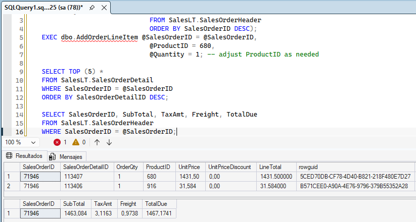

## Creación de una función escalar para realizar cálculos reutilizables

Creé una función escalar que calcula y devuelve el valor total de un pedido a partir de los importes de sus líneas en AdventureWorksLT.

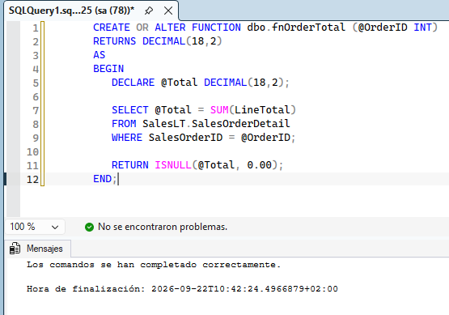

Finalmente, ejecuté el código T-SQL necesario para utilizar la función y comprobar el total calculado.

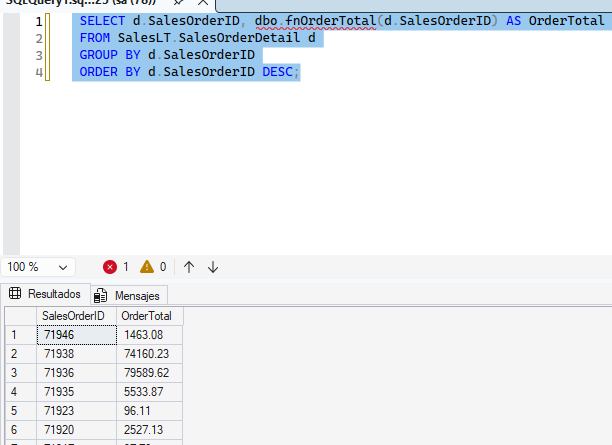

## Creación de una función con valores de tabla en línea (TVF)

Construí una función con valores de tabla que devuelve los pedidos de un cliente concreto de AdventureWorksLT. Este tipo de función se puede utilizar directamente en consultas `SELECT` y en combinaciones `JOIN`.

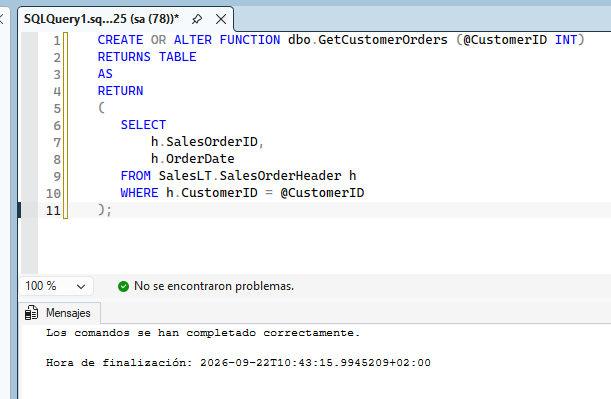

Ejecuté el código T-SQL para consultar la función y revisar los pedidos devueltos.

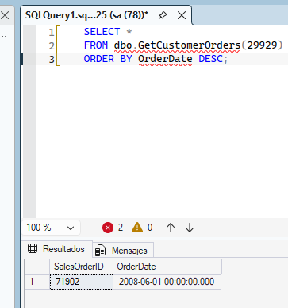

Después combiné la función con la tabla de clientes para obtener la información relacionada.

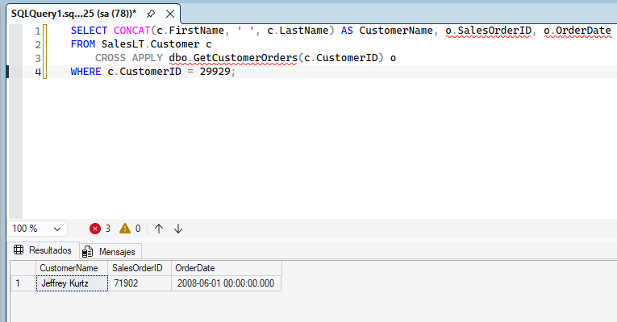

## Creación de un trigger para registrar cambios

Añadí un trigger para registrar las actualizaciones de los totales de los pedidos cuando se modifican los detalles de los pedidos del esquema `SalesLT`. Así, los cambios quedan controlados automáticamente.

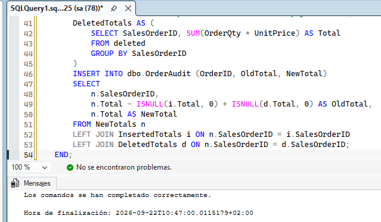

Por último, probé el trigger realizando una modificación y comprobé que se registraba correctamente.

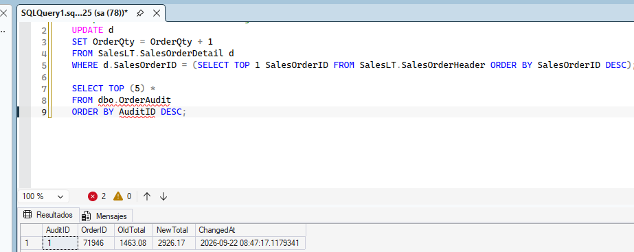